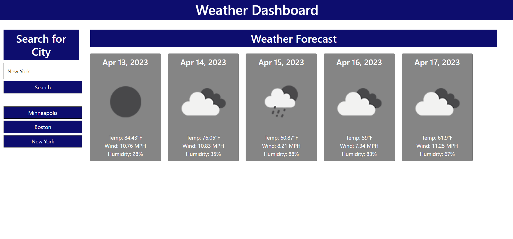

# weather-app

## Description
This is a weather app that provides a forecast of weather in a given city for the next five days. This application pulls data from the Open Weather Map API to provide a forecast of general conditions, average temperature, windchill, and humidity for a given day. The page will also save your search history while remaining on the site, allowing previous searches to be brought up again.

## Installation
N/A

## Deployed Page

## Usage
Access the deployed page at (placeholder). Type a city name into the field on the left side of the page, then click on the "Search" button to bring up the weather data. If you want to access a previous search, click on the button corresponding to the city name underneath the Search button.

## Credits
The Open Weather Map API was used in the creation of this application.
